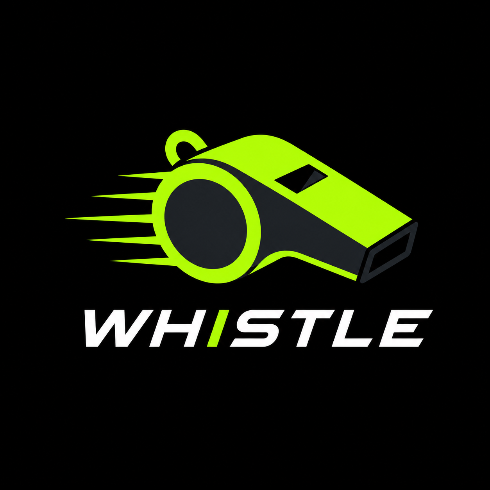

<div align="center">



# 🏟️ Whistle

**Your ultimate sports companion — track matches, leagues, and teams on the go.**

[](https://swift.org)
[](https://developer.apple.com/ios/)
[](https://developer.apple.com/xcode/)
[](LICENSE)

</div>

---

## 📖 Overview

**Whistle** is a native iOS application built with **Swift** and **UIKit** that keeps sports fans connected to the action. Browse live leagues across football, basketball, cricket, and tennis — save your favorite teams, explore upcoming fixtures, and dive deep into team details, all with a sleek, localized interface that feels right at home in Arabic or English.

---

## ✨ Features

| Feature | Description |
|---|---|
| 🏆 **Multi-Sport Support** | Football, Basketball, Cricket & Tennis leagues |
| 📅 **Upcoming Matches** | Browse fixtures with match details at a glance |
| ⭐ **Favorites** | Save teams and leagues with Core Data persistence |
| 🏅 **Team Details** | In-depth team info, players, and season stats |
| 🌍 **Localization** | Full Arabic & English support (RTL/LTR) |
| 🎨 **Onboarding** | Beautiful, illustrated onboarding experience |
| 📴 **Offline-Ready** | Core Data caching for offline browsing |

---

## 🖼️ App Flow

```
Splash → Onboarding → Main Tab Bar
                          ├── Leagues        (browse all sports leagues)
                          ├── League Details (fixtures + standings)
                          ├── Team Details   (squad, info, stats)
                          ├── Favorites      (saved teams & leagues)
                          └── Settings       (language & preferences)
```

---

## 🏗️ Architecture

Whistle follows the **MVP (Model-View-Presenter)** pattern for clean separation of concerns and testability:

```
Whistle/
├── Application/          # AppDelegate, SceneDelegate, Info.plist
├── Features/
│   ├── Splash/           # Launch screen & flow
│   ├── Onboarding/       # First-run walkthrough
│   ├── Main/             # Tab bar controller
│   ├── Leagues/          # Sports & league listing
│   ├── LeaguesDetails/   # Fixtures and league info
│   ├── TeamDetails/      # Team squad & stats
│   ├── Favorites/        # Persisted favorites
│   ├── Settings/         # App preferences
│   └── sports/           # Shared sports utilities
├── Model/                # Entities, DTOs, network services
├── Utils/                # Helpers, enums, alert states
├── Assets.xcassets/      # Images, icons, color palettes
└── Whistle.xcdatamodeld/ # Core Data schema
```

---

## 🎨 Design System

The app uses a curated dark-themed color palette defined in `Assets.xcassets`:

| Token | Usage |
|---|---|
| `DeepForestNight` | Primary background |
| `PitchTurfGreen` | Accent & interactive elements |
| `LimeNeon` | Highlights & active states |
| `DarkGray` | Secondary surfaces |
| `primary` | Brand primary color |

---

## 🚀 Getting Started

### Prerequisites

- **Xcode** 14.0 or later
- **iOS** 14.0+ deployment target
- **Swift** 5.0+

### Installation

1. **Clone the repository**

   ```bash
   git clone https://github.com/A7mednage71/El-Modarag.git
   cd El-Modarag
   ```

2. **Open in Xcode**

   ```bash
   open Whistle.xcodeproj
   ```

3. **Select a simulator or device**, then press **⌘R** to build and run.

> **Note:** No CocoaPods or SPM dependencies are required — the project is self-contained.

---

## 🧪 Testing

Unit and presenter tests live under `WhistleTests/`. The testing target includes mock implementations for both Core Data and the network layer, keeping tests fast and isolated.

```bash
# Run all tests via CLI
xcodebuild test \
  -project Whistle.xcodeproj \
  -scheme Whistle \
  -sdk iphonesimulator \
  -destination 'platform=iOS Simulator,name=iPhone 15'
```

Or simply use Xcode's **Test Navigator** (`⌘6`) and press **⌘U**.

---

## 🌍 Localization

The app ships with **Arabic** and **English** localizations.

- String catalogs: `Whistle/Localizable.xcstrings`
- Language packs: `ar.lproj/`, `Base.lproj/`

To add a new language, go to **Project Settings → Info → Localizations** in Xcode and add your target language.

---

## 🤝 Contributing

Contributions are welcome! Here's how:

1. **Fork** the repository
2. **Create** a feature branch: `git checkout -b feat/amazing-feature`
3. **Commit** your changes: `git commit -m 'feat: add amazing feature'`
4. **Push** to your branch: `git push origin feat/amazing-feature`
5. **Open** a Pull Request

Please keep changes small and focused, and follow the existing project structure and naming conventions.

> For bugs or feature requests, please [open an issue](https://github.com/A7mednage71/El-Modarag/issues).

---

## 👥 Team Members & Task Allocation

### 👨‍💻 Ahmed Nageh
- Localization + Settings Screen
- Testing
- Create Three Onboarding Screens
- Leagues Details UI + View Model
- Create Team Details Screen UI
- Show Leagues List From API Based On Sport
- App Logo & Launch Screen & Splash Screen
- Save / Delete / Show Favorites from Core Data

### 👨‍💻 Omar Amer
- Dependency Injection (DI) & App Container
- Sports / Home Screen UI
- Leagues List Screen UI
- Favorites Screen UI
- Fetch Leagues Details From API
- Handle Disappear of Onboarding Screen
- Fetch Team Details From API

### 🤝 Shared Tasks (Omar Amer & Ahmed Nageh)
- Create Project Structure and Folders and Upload it to Github
- API Models & Create API Key

---

## 📄 License

This project is licensed under the **MIT License** — see the [LICENSE](LICENSE) file for details.

---

<div align="center">

Made with ❤️ for the love of sport

</div>
